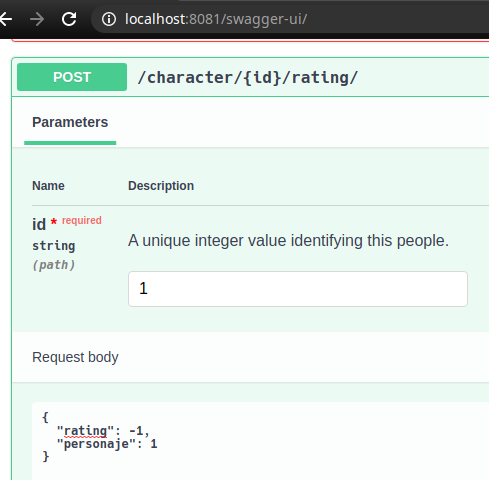
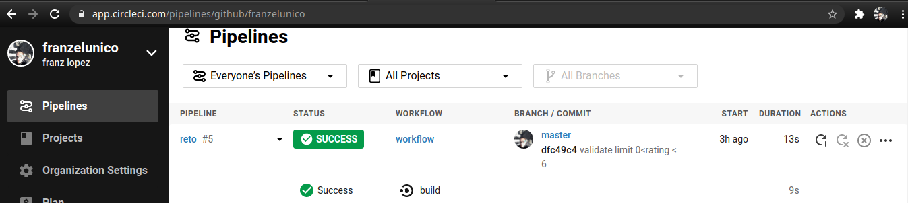

# Git

```console
franzlopezsrl@code:~$ git clone https://github.com/franzelunico/starwarsAPI.git
franzlopezsrl@code:~$ cd starwarsAPI
```

# Con Docker

```console
franzlopezsrl@code:~$ docker-compose build
franzlopezsrl@code:~$ docker-compose up
franzlopezsrl@code:~$ docker exec -it starwarsapi_web_1 python manage.py migrate
franzlopezsrl@code:~$ docker exec -it starwarsapi_web_1 sh createadmin.sh
franzlopezsrl@code:~$ docker exec -it starwarsapi_web_1 python manage.py makemigrations starwars
franzlopezsrl@code:~$ docker exec -it starwarsapi_web_1 python manage.py migrate starwars
franzlopezsrl@code:~$ docker exec -it starwarsapi_web_1 python manage.py test
```

# Sin Docker

```console
franzlopezsrl@code:~$ python3 -m venv env
franzlopezsrl@code:~$ source env/bin/activate
franzlopezsrl@code:~$ pip install -r requirements.txt 
franzlopezsrl@code:~$ python manage.py migrate
franzlopezsrl@code:~$ sh createadmin.sh
franzlopezsrl@code:~$ python manage.py makemigrations starwars
franzlopezsrl@code:~$ python manage.py migrate starwars
franzlopezsrl@code:~$ python manage.py test
franzlopezsrl@code:~$ python manage.py runserver 0.0.0.0:8081
```

# Endpoints

| HTTP Method   |      Action      |  URL                                      |
|---------------|:----------------:|------------------------------------------:|
| GET           |  retrieve        | http://localhost:8081/character/1/        |
| POST          |    create        | http://localhost:8081/character/1/rating/ |
| GET           |                  | http://localhost:8081/swagger-ui/         |


# Swagger-ui


# CircleCI: Continuous Integration and Delivery

